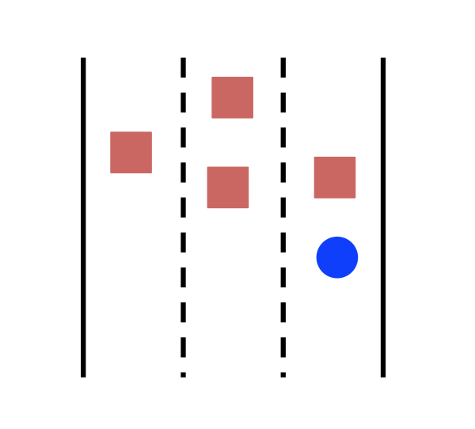

# CarND-Path-Planning-Project

[](http://www.udacity.com/drive)


<p align="center">

</p>


Overview
---


In this project vehicle drives in a simulation environment autonomously without human intervention. The fundamental code block used in this project is based on Path Planning Course at Udacity Self Driving Cars online course.


Pipeline
---


*The overall pipeline along with the results will be described here!*

<br>

I. Base of the source code that I've used for this project is inspired by the Q&A session hosted by Aaron and David.


</br>


II. The ```main.cpp``` is the main code that contains algorithms and developments usde for the self driving vehicle.


</br>

III. In order to avoid the jerk when the vehicle starts, ```ref_vel``` is set to 5 miles per hour and we gradually increases to the speed limit 49.9 miles per hour.


IV. Here I try to talk about some of the important variables that were used in the code.
- ```frontPass``` is a boolean variable that is always true unless there is another vehicle in too close in front of us. This variable remains false until we pass the vehicle in front of us. Even if the vehicle in front of is too close initially and then distances itself more than limit, ```frontPass``` remains false. This variable becomes true once we pass the vehicle in front of ego vehicle.

- ```too_close``` is a boolean variable that becomes true whenever there is a another vehicle too close in front of ego vehicle. This variable becomes false whenever we pass the front vehicle or the distance becomes higher than 30 meter threshold.

- ```turn_right``` and ```turn_left``` are two variables that determine whether it is safe to pass the front vehicle and move to the left/right lane. The condition for passing the front vehicle is that there must not be any other vehicle in the 50 meter front and 7 meter behind of the ego vehicle in the adjacent left/right lane.

- ```right_side``` and ```left_side``` are two interesting variables. Suppose that the ego vehicle is stuck in the following scenario. The blue circle is the ego vehicle. As you can see, all three lanes are occupied by other vehicle. As a result it does not make much difference which lane to be. However, it makes more sense to be in the center lane since the car will have more option in future in case other lanes become open for passing. These two variables remain true if it is safe for the car to move into the center lane. Ego vehicle does not necessarily pass the front vehicle, it just moves to the center lane. 
<p align="center">

</p>
</br>
```cpp
  default_random_engine gen;
  normal_distribution<double> dist_x(0, std_pos[0]);
    normal_distribution<double> dist_y(0, std_pos[1]);
    normal_distribution<double> dist_theta(0, std_pos[2]);
  for (int i = 0; i<num_particles;++i) 
      {
        
      if (fabs(yaw_rate) < 0.00001){
        particles[i].x += dist_x(gen) + velocity * delta_t*cos(particles[i].theta);
        particles[i].y += dist_y(gen) + velocity * delta_t*sin(particles[i].theta);
        particles[i].theta += dist_theta(gen);
      } else{
        particles[i].x += dist_x(gen) + (velocity/yaw_rate)*(sin(particles[i].theta+yaw_rate*delta_t)-sin(particles[i].theta));
        particles[i].y += dist_y(gen) + (velocity/yaw_rate)*(cos(particles[i].theta)-cos(particles[i].theta+yaw_rate*delta_t));
        particles[i].theta += dist_theta(gen) + yaw_rate*delta_t;
          }
      }
```
</br>

</br>


V. Click on the following imahe in order to watch final video of car going around the whole track without violating any of the rules. 
</br>

[](https://youtu.be/FRMAPzO9M08)

</br>
<br></br>